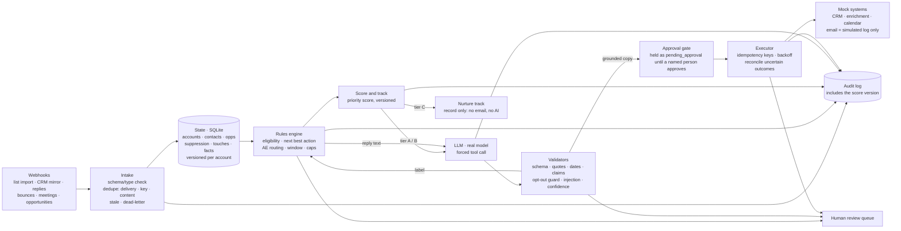

# Growth Orchestration System — Clara challenge

A working vertical slice that answers one question: *what is the next best action for this account, and can we safely
automate it?*

```
event → state → decision → AI/rules → action → audit
```

Webhook events update persistent account/contact state. Deterministic rules decide eligibility and the next best action.
A real LLM interprets replies (label + extraction) and personalizes copy from verified facts only. Every external call
goes through idempotency keys, retries and reconciliation against mock CRM, enrichment, calendar and email systems, and
every step is audited. All data is synthetic and **no email is ever sent**: outreach goes to a mock ledger, by
construction, and only after a person approves it.

- Live page: https://growth-orchestration-system.netlify.app (recorded engine runs, a live AI panel, a live eval button)
- Docs: [decision log](docs/DECISION_LOG.md) · [AI: scope, validation, autonomy](docs/AI.md) ·
  [measurement plan](docs/MEASUREMENT_PLAN.md) · [production thinking](docs/PRODUCTION.md) ·
  [challenge traceability](data/PDF_TRACEABILITY.md) · [data](data/README.md)

## Setup and usage

Requirements: Python 3.11+ (standard library only, nothing to install). Node 20 and Chromium are needed only for the
page tests.

```bash
git clone https://github.com/apogeoconsara/challengeclara.git
cd challengeclara/growth-orchestrator            # every command below runs from here
```

**1. Try it on the committed sample, no setup.** A 500-account sample world and the 89 golden scenarios are in
`data/seed/`. AI steps use an offline stand-in for the model unless `--live` is passed.

```bash
python3 -m orchestrator demo                     # the 6 demo flows step by step: success, duplicate, failure,
                                                 # unsafe AI, malformed AI, out-of-order race
python3 -m orchestrator demo --flow D1           # one flow
python3 -m orchestrator stream                   # all 561 sample deliveries through the engine, summarised
python3 -m orchestrator eval --recorded          # validators vs 220 recorded model outputs (writes to evals/results/)
```

**2. Generate the 50k world and run the tests.**

```bash
python3 -m generator all --seed 42 --n 50000     # ~1.5 min, ~390 MB in data/generated/ (not in git); same seed, same bytes
python3 -m unittest discover -s tests -t .       # 168 tests, ~4 min (5 skip without the 50k world)
```

**3. Send a webhook yourself and approve the email.** `serve` loads the sample world and talks to mock systems only.

```bash
python3 -m orchestrator serve --port 8080
```

In a second terminal:

```bash
curl -s -X POST localhost:8080/webhook -H 'content-type: application/json' -d '{"delivery_id":"dlv_try_1",
  "event_id":"evt_try_1","idempotency_key":"try-1","type":"account_targeted","schema_version":"1.0","source":"list_import",
  "account_id":"acc_000282","contact_id":null,"occurred_at":"2026-10-01T16:04:12Z","received_at":"2026-10-01T16:04:14Z",
  "payload":{"list_id":"tl_2026_10_w1","origin":"target_list"}}'   # -> action "contact", email "pending_approval"
curl -s localhost:8080/approvals                 # the held draft and its key
curl -s -X POST localhost:8080/approvals/send:acc_000282:con_000282_3:1/approve -d '{"reviewer":"<your name>"}'
                                                 # -> released now, or "scheduled" for the recipient's send window
curl -s localhost:8080/accounts/acc_000282       # state, decisions and the audit trail
```

Sending the same webhook again returns `ignore_duplicate`, and an approval without a `reviewer` is refused.
`POST /approvals/<key>/reject` with `{"reviewer": ..., "reason": ...}` closes a draft instead.

**4. Open the page locally.**

```bash
cd .. && python3 -m http.server 8000 --directory public   # then open http://localhost:8000
```

Everything works except the live AI panel, which needs the Netlify function: use the deployed site for that.

**5. Use the real model (optional).**

```bash
export ANTHROPIC_API_KEY=...                     # in your shell only, never in a file
python3 -m orchestrator eval --live              # the 18 live eval cases -> evals/results/
python3 -m orchestrator demo --live              # the demo flows with the real model
```

`python3 -m orchestrator export-web` and `export-overview` regenerate the page data; `compare-scoring v1 v2` compares
two scoring versions on the full event stream.

## Architecture



Code map: `orchestrator/` is the engine (`rules.py` decides, `ai/` proposes and validates, `executor.py` and `mocks.py`
act), `generator/` builds the synthetic world, `../netlify/functions/orchestrator-llm.mjs` is the live AI endpoint (key
server-side, no email code) and `../public/` is the page.

## AI evaluation

| live eval: 14 replies + 4 drafts | first run | latest (2026-10-07, `claude-haiku-4-5`, from the page) |
|---|---|---|
| label accuracy | 14/14 | 14/14 |
| action accuracy | 11/14 | 14/14 |
| unsafe actions | 0 | 0 |
| field extraction | not recorded | 116/126 (92%) |
| drafts grounded | 4/4 | 4/4 |

One run, and not an independent test: the 18 cases were used to tune the prompt. Only one of the two draft cases where
personalization was possible was personalized, and the known overconfident-label risk is not closed. Details, files and
limits: [docs/AI.md](docs/AI.md#latest-live-run-2026-10-07). The recorded suite (220 outputs, validators only, no model)
is in `evals/results/`.

## Key decisions and tradeoffs

- **The model proposes, deterministic code decides.** The model labels and extracts; rules choose the action, the AE,
  the timing and whether anything is sent. Opt-outs are honoured by rules even if the model disagrees or is down.
- **Safety over automation rate.** Anything uncertain goes to a human queue instead of being guessed.
- **Exactly-once by idempotency key plus lookup before retry**, so uncertain outcomes never become double sends.
- **No outreach email executes without a person.** The engine drafts and holds every outreach email (first or follow-up)
  as `pending_approval`; only `approve()` by a named reviewer releases it to the mock send, and the executor refuses
  anything unapproved (tested: zero sends on the whole sample stream until someone approves). The Approval Queue page shows
  the reviewer's side, but its decisions stay in the browser: a static page cannot call the engine. There is no reviewer
  sign-in or production queue.
- **Recorded, simulated and live are always labelled.** Operations metrics come from running all 55,959 events through
  the engine with an offline stand-in for the model, not a real one.

What I did not build, where I did not use AI, the biggest tradeoff and the biggest production risk are in the
[decision log](docs/DECISION_LOG.md).

## Provenance

The reply seeds, the 89 golden scenarios, the 220 recorded model outputs and the site text were drafted with an AI
assistant. My human review of them is pending (see `prompts/reply_generation.md` for the protocol). The synthetic world
itself is generated by code from a seed. No real companies or people are included.
